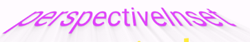
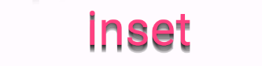
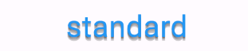

# text_3d: 3D Text Effects for Flutter

Easily incorporate visually captivating 3D text effects into your Flutter applications.
The `text_3d` library offers a range of predefined styles, and the flexibility to customize, letting
your creativity roam free.


## Table of Contents

- [Installation](#installation)
- [Usage](#usage)
- [Available Styles](#available-styles)
- [Example](#example)
- [Custom Styles](#custom-styles)
- [Contributing](#contributing)
- [License](#license)

## Installation

Add the following line to your `pubspec.yaml` under `dependencies`:

```
text_3d: latest_version
```

Then run:

```
flutter pub get
```

## Usage

To use the `ThreeDText` widget:

```dart
import 'package:text_3d/text_3d.dart';
```

## Available Styles

- `standard`: A basic 3D effect.
- `raised`: Text appears raised from the background.
- `inset`: Text appears pressed into the background.
- `perspectiveRaised`: Text has a raised perspective look.
- `perspectiveInset`: Text has a pressed perspective look.
- `perspectiveLeft`: Text slants to the left in perspective.
- `perspectiveRight`: Text slants to the right in perspective.

## Example

Here's a quick example of how to use the `ThreeDText` widget:


```dart
 ThreeDText(
text: 'perspectiveRaised',
textStyle: TextStyle(fontSize: 40, color: Colors.green),
depth: 10,
style: ThreeDStyle.perspectiveRaised,
angle: pi / 6,
perspectiveDepth: 30, // Adjust this value to control perspective intensity
),

```



```dart
 ThreeDText(
text: 'perspectiveInset',
textStyle: TextStyle(fontSize: 40, color: Colors.purpleAccent),
depth: 40,
style: ThreeDStyle.perspectiveInset,
angle: pi / 6,
perspectiveDepth: 20,
),
```


```dart
ThreeDText(
text: 'perspectiveRight',
textStyle: TextStyle(fontSize: 25, color: Colors.yellow),
style: ThreeDStyle.perspectiveLeft,
perspectiveDepth: 45.0,
),
```


```dart
  ThreeDText(
text: 'perspectiveLeft',
textStyle: const TextStyle(
fontSize: 25,
color: Colors.pink ,
fontWeight: FontWeight.bold),
depth: 6,
style: ThreeDStyle.perspectiveLeft,
perspectiveDepth: -45.0
),
```



```dart
ThreeDText(
text: "inset",
textStyle: TextStyle(
fontSize: 64,
color: Colors.pinkAccent,
),
style: ThreeDStyle.inset,
),
```


```dart
ThreeDText(
text: 'raised',
textStyle: TextStyle(fontSize: 64, color: Colors.blue),
depth: 10,
style: ThreeDStyle.raised,
),
```



```dart
ThreeDText(
text: 'standard',
textStyle: TextStyle(fontSize: 40, color: Colors.blue),
depth: 5,
style: ThreeDStyle.standard,
),
```


```dart
ThreeDText(
text: 'inset with angle',
textStyle: TextStyle(fontSize: 40, color: Colors.deepOrange),
depth: 5,
style: ThreeDStyle.inset,
angle: 70,
),
```

## Custom Styles

While the library comes packed with a range of predefined styles, it's designed with flexibility in
mind. You can adjust properties like `angle`, `depth`, and `perspectiveDepth` to create unique 3D
effects tailored to your design vision.

## Contributing

Pull requests are welcome. For major changes, please open an issue first to discuss what you would
like to change.

## License

[MIT](https://choosealicense.com/licenses/mit/)

---

Copy the above text into your README.md file, and it should be well-documented and formatted for
users and developers alike!